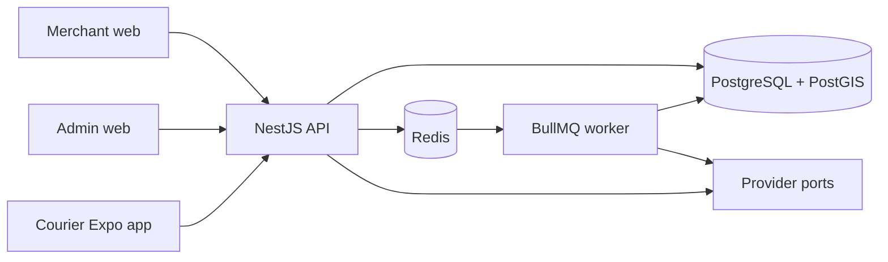

# Wasel architecture

## Context

Wasel starts as a modular monolith. One deployable API owns transactions and
domain rules; a separate worker runs retryable background work. This preserves
strong consistency for order assignment and money while keeping domain
boundaries clear enough to extract only when operational evidence justifies it.

Phase 1 uses these boundaries for identity, onboarding, and verification. Later
delivery and financial journeys remain unimplemented.

## Domain modules

The API will be divided by domain, not technical layer:

- Identity: authentication, users, OTP challenges, and RBAC
- Merchant: merchants, memberships, stores, customers, and addresses
- Courier: profiles, vehicles, documents, availability, and verification
- Pricing: versioned rules and expiring quotes
- Orders: aggregate, state machine, immutable events, and cancellation policy
- Dispatch: offers, atomic acceptance, candidate selection, and expiry
- Tracking: courier locations and realtime projection
- Fulfilment: pickup and delivery proofs
- Finance: wallets, immutable ledger entries, and settlements
- Operations: support cases, feature flags, admin interventions, and audit
- Notifications: templates and delivery through replaceable provider adapters

Modules may import shared contracts and infrastructure ports. They must not read
another module's tables directly. Cross-module mutations occur through an
application service or a durable domain event inside the same monolith.

## Runtime boundaries

| Runtime        | Responsibility in Phase 1                                        |
| -------------- | ---------------------------------------------------------------- |
| API            | Authentication, merchant/courier onboarding, verification, audit |
| Worker         | Redis/BullMQ connection and graceful shutdown foundation         |
| Admin web      | Arabic/RTL operations verification console                       |
| Merchant web   | Arabic/RTL merchant profile, stores, and staff                   |
| Courier mobile | RTL onboarding, private document upload, and verification status |

## Provider boundary

Maps, OTP/SMS, notifications, payments, object storage, and phone masking are
ports in `@wasel/providers`. Domain code depends only on these interfaces. A
local OTP and protected filesystem object-storage adapters support development.
Provider selection belongs in application composition, never inside domain rules.

## Cross-cutting rules

- Validate untrusted inputs at the process boundary.
- Use E.164 phone numbers and store timestamps in UTC.
- Use structured logs with correlation identifiers when request middleware is added.
- Never log OTPs, authorization headers, or unredacted sensitive customer data.
- Write sensitive admin actions to the append-only audit log.
- Use idempotency records for order creation and financial commands.
- Enforce aggregate versions on state-changing commands.
- Store every order transition as an append-only `OrderEvent` in the same transaction.
- Store all money movements as append-only `LedgerEntry` rows; wallet balance is a projection.
- Keep COD and other unresolved capabilities disabled with feature flags.

## Scaling path

Scale stateless API and worker processes horizontally first. Use database indexes,
read replicas, Redis caching, queue partitioning, and object storage before
extracting services. If a domain is later extracted, its tables and events move
with it; no shared database writes are allowed after extraction.
