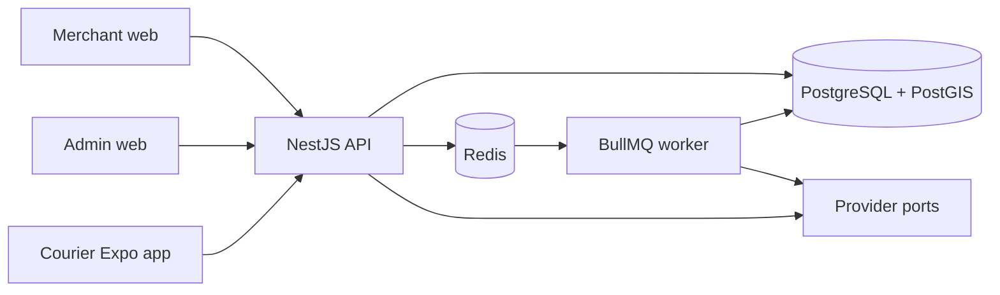

# WASSAL architecture

## Context

WASSAL starts as a modular monolith. One deployable API owns transactions and
domain rules; a separate worker runs retryable background work. This preserves
strong consistency for order assignment and money while keeping domain
boundaries clear enough to extract only when operational evidence justifies it.

Phase 3 uses these boundaries for identity/onboarding, customers, zones,
pricing, quotes, direct courier-selected assignment, delivery/return execution,
and offline commission reconciliation. Automated dispatch, tracking, wallets,
and payment providers remain unimplemented.

## Domain modules

The API will be divided by domain, not technical layer:

- Identity: authentication, users, OTP challenges, and RBAC
- Merchant: merchants, memberships, stores, customers, and addresses
- Courier: profiles, vehicles, documents, verification, zone memberships, and
  the self-service order marketplace
- Pricing: versioned rules and expiring quotes
- Orders: aggregate, state machine, immutable events, and cancellation policy
- Marketplace: privacy-safe discovery and atomic direct acceptance
- Dispatch: dormant future offer/matching models only
- Tracking: dormant future models only; no Phase 3 writers or routes
- Fulfilment: pickup and delivery proofs
- Finance: immutable courier ledger, weekly settlements, and externally
  completed payment records
- Operations: support cases, feature flags, admin interventions, and audit
- Notifications: templates and delivery through replaceable provider adapters

Modules may import shared contracts and infrastructure ports. They must not read
another module's tables directly. Cross-module mutations occur through an
application service or a durable domain event inside the same monolith.

## Runtime boundaries

| Runtime        | Responsibility through Phase 3                                                                                      |
| -------------- | ------------------------------------------------------------------------------------------------------------------- |
| API            | Identity, onboarding, zones/pricing, orders, direct acceptance, lifecycle, courier accounting, audit                |
| Worker         | Idempotent weekly settlement close and overdue projection jobs; no dispatch/tracking jobs                           |
| Admin web      | Arabic/RTL verification, operations, settings, courier accounts, settlements, payment/reconciliation workspace      |
| Merchant web   | Arabic/RTL merchant setup, customers, quote/order creation, and full lifecycle timeline                             |
| Courier mobile | RTL onboarding plus approved-courier marketplace, assigned order workflow, external navigation, history, statements |

## Provider boundary

Maps, OTP/SMS, notifications, future payments, object storage, and phone masking are
ports in `@wasel/providers`. Domain code depends only on these interfaces. A
local OTP, protected filesystem object-storage, and deterministic maps adapters
support development. No payment provider is composed or invoked in Phase 3;
external payments are accounting records only. Provider selection belongs in
application composition, never inside domain rules.

## Cross-cutting rules

- Validate untrusted inputs at the process boundary.
- Use E.164 phone numbers and store timestamps in UTC.
- Use structured logs with correlation identifiers when request middleware is added.
- Never log OTPs, authorization headers, or unredacted sensitive customer data.
- Write sensitive admin actions to the append-only audit log.
- Use idempotency records for order creation and financial commands.
- Enforce aggregate versions on state-changing commands.
- Store every order transition as an append-only `OrderEvent` in the same transaction.
- Store courier liabilities/corrections as append-only `CourierLedgerEntry`
  rows; settlement totals are rebuildable projections.
- Keep COD and other unresolved capabilities disabled with feature flags.

## Scaling path

Scale stateless API and worker processes horizontally first. Use database indexes,
read replicas, Redis caching, queue partitioning, and object storage before
extracting services. If a domain is later extracted, its tables and events move
with it; no shared database writes are allowed after extraction.
