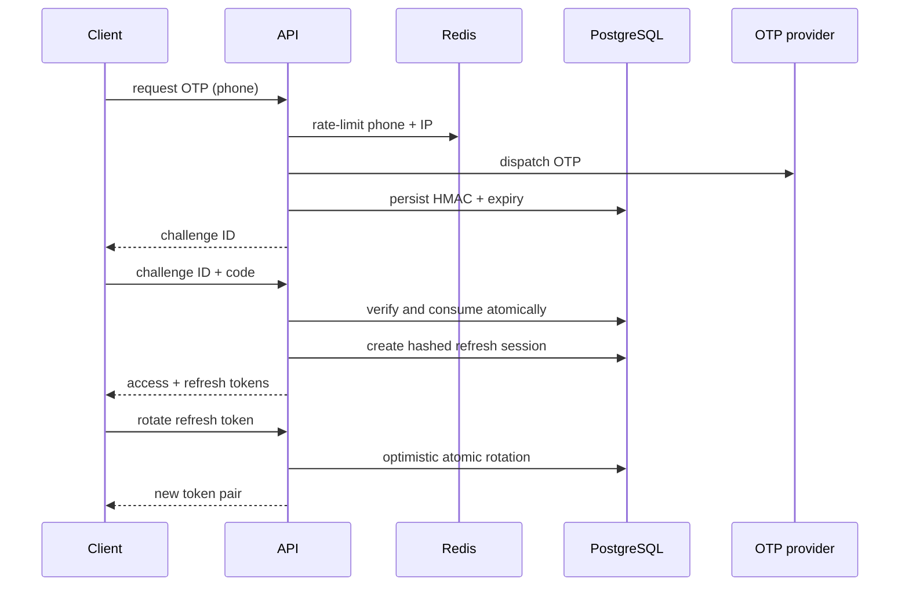

# Authentication and session flow

## OTP request

1. Normalize a supported Egyptian mobile number to `+20…`.
2. Apply Redis limits by phone and source IP.
3. Enforce the persisted resend cooldown.
4. Ask the configured provider to dispatch an OTP.
5. Store a peppered HMAC, expiry, attempt count, and provider reference.
6. Return the same response shape whether or not a user already exists.

The local provider uses `OTP_MOCK_CODE`. It is not constructed in production;
a production deployment must bind a real provider.

## OTP verification

The server checks the HMAC in constant time, expiry, consumption state, and
attempt limit. The challenge is consumed transactionally. An invited pending
user becomes active; public registration is restricted to merchant owner or
courier. A blocked or suspended account receives no session.

## Session model

- Access token: signed HS256 JWT, default lifetime 15 minutes.
- Refresh token: 384 bits of random data, returned once to the client.
- Persistence: only a SHA-256 refresh digest is stored.
- Rotation: every refresh atomically replaces the digest and remembers the
  immediately previous digest.
- Replay response: use of the previous refresh token revokes the session.
- Logout: revokes one session.
- Logout all: revokes every live session for the user and writes an audit event.

Every protected request verifies the JWT and then confirms the session and user
are still active in PostgreSQL. Suspension and logout therefore take effect
without waiting for the JWT to expire.

Web clients keep access credentials in process memory. The Expo client stores
its token bundle with `expo-secure-store`. A production browser deployment
should place refresh credentials in a same-site, secure, HTTP-only cookie at its
edge/BFF boundary.
