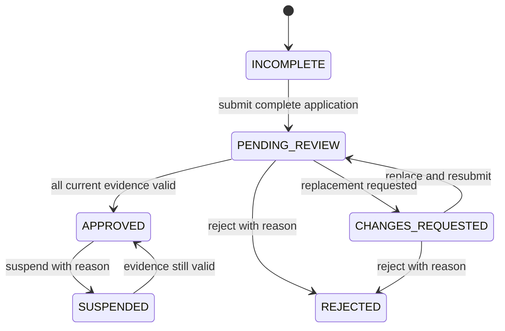

# Courier verification workflow

## Required evidence

An application requires front and back of national ID, driver licence, vehicle
licence linked to an owned motorcycle, profile photo, and an active motorcycle.
Documents accept JPEG, PNG, or PDF. Licence/identity expiry is recorded when
available. Submission freezes edits until an administrator requests changes.

## State transitions

Document actions compare `reviewVersion`; profile actions compare `version` and
the allowed source state. The update predicate contains the expected version and
source state; a zero-row update produces HTTP 409 and forces a reload.

`courierOperationalEligibility` is a side-effect-free future policy. It returns
false unless the account is active, the profile is approved, an active
motorcycle exists, and every current required document is approved and
unexpired. Phase 1 does not expose availability or dispatch.
