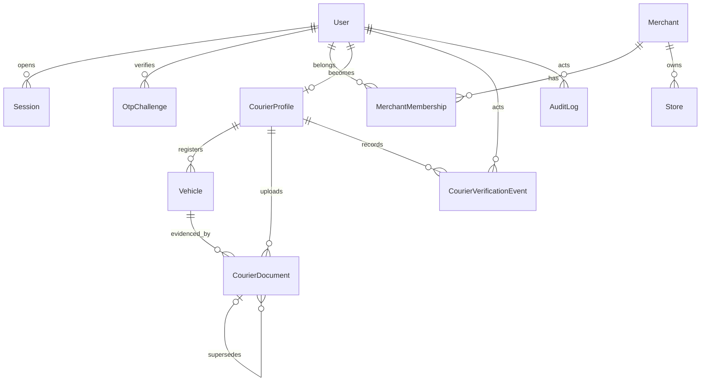

# Phase 1 database additions

Migration:
`20260723094656_phase_1_identity_onboarding_verification`

The migration adds only Phase 1 fields and tables. It does not edit the Phase 0
migration, remove immutable triggers, or remove spatial indexes.

## New records

- `Session`: hashed rotating refresh session and revocation state
- `CourierVerificationEvent`: immutable review timeline

## Important indexes and constraints

- unique user phone and refresh digests
- active membership lookup and merchant role/active queue
- courier verification queue
- current document status and expiry lookup
- partial unique current document type per courier
- actor/entity audit history
- retained PostGIS GiST indexes from Phase 0

Required columns are backfilled before `NOT NULL` is applied, so the migration
can upgrade a seeded Phase 0 database as well as a clean database.
