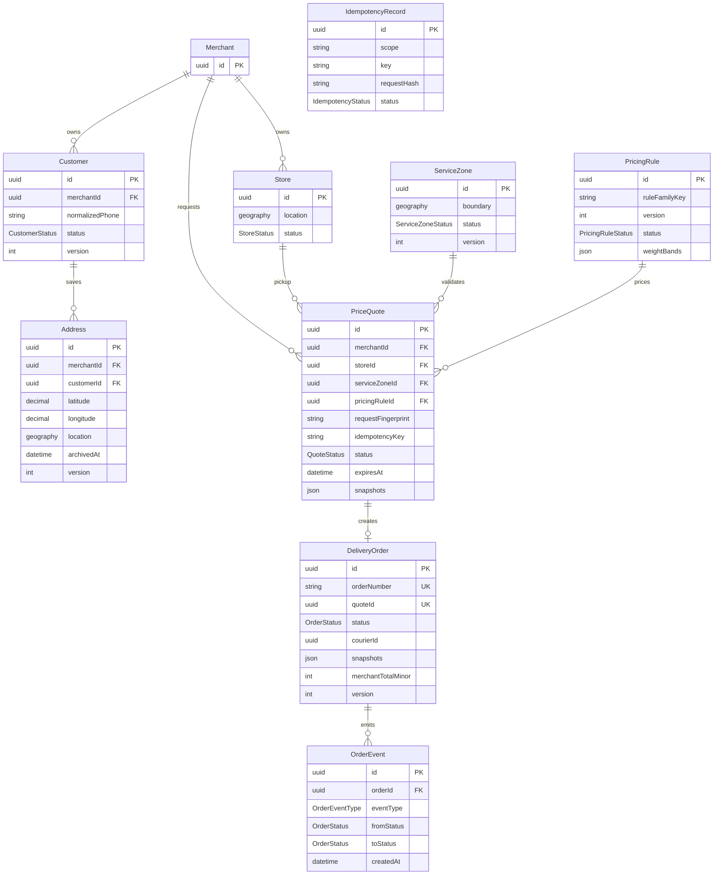

# Phase 2 database diagram

`PriceQuote`, `DeliveryOrder` snapshots, `PricingRule` historical fields, and
`OrderEvent` rows are protected by database triggers. Address and zone geometry
have GiST indexes; customer, quote expiration/status, merchant/status/date,
order number, zone, pricing resolution, event, and cancellation reporting have
B-tree indexes.
