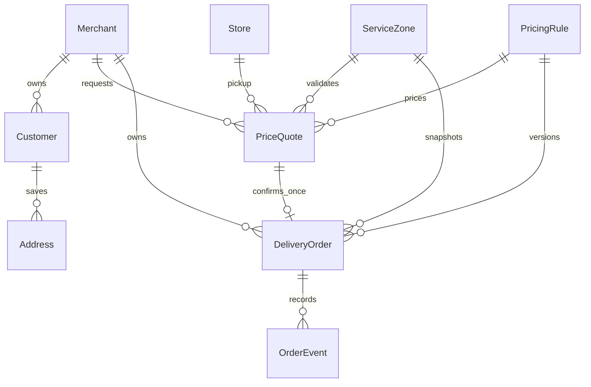
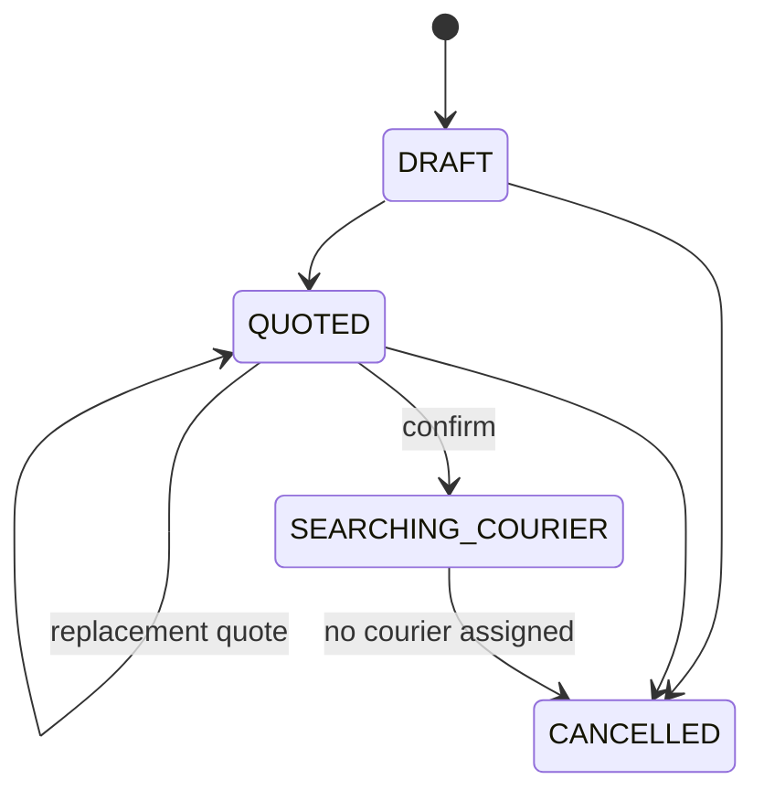

# Phase 2 order domain

## Aggregate and snapshots

`DeliveryOrder` is the aggregate root. A Phase 2 order references its merchant,
store, optional live customer, service zone, pricing rule version, and source
quote, but historical evidence is read from immutable snapshots:

- customer identity at confirmation;
- pickup and drop-off addresses;
- package and delivery instructions;
- authoritative route distance/duration/provider;
- pricing-rule version and complete monetary calculation.

Editing a customer or saved address therefore never changes an old order.
`OrderEvent` is append-only and records every state transition and significant
action with actor, source, reason, merchant message, internal message,
correlation data, and optional metadata.

## State machine

The full planned model contains:

`DRAFT`, `QUOTED`, `SEARCHING_COURIER`, `COURIER_ASSIGNED`,
`COURIER_ARRIVING_PICKUP`, `AT_PICKUP`, `PICKED_UP`, `IN_TRANSIT`,
`AT_DROPOFF`, `DELIVERED`, `DELIVERY_FAILED`, `RETURNING_TO_STORE`,
`RETURNED`, and `CANCELLED`.

Only these transitions can execute in Phase 2:

Controllers and UIs cannot write order status. The pure policy in
`apps/api/src/orders/order-domain.ts` validates transitions and cancellation.
The data model contains later states for compatibility, but Phase 2 services
never activate them.

## Confirmation

Confirmation requires an active, unexpired quote. In a serializable
transaction the API:

1. claims the idempotency key and locks the quote row;
2. verifies merchant/store ownership and active store status;
3. rejects an already-consumed or expired quote;
4. rechecks pickup/drop-off against the current active service zone;
5. creates the order and copies every snapshot and minor-unit amount;
6. appends draft, quoted, confirmed, and courier-search-requested events;
7. consumes the quote and records an audit entry.

`DeliveryOrder.quoteId` is unique. Concurrent confirmation can create only one
order, and an identical idempotent retry returns it.

## Cancellation policy

Merchant owner/manager cancellation and operations/super-admin cancellation
use separate reason sets. `other` requires details. Staff cancellation is
denied by default.

`DRAFT`, `QUOTED`, and `SEARCHING_COURIER` can be cancelled only while
`courierId` is null. The API locks the row, checks the client version, updates
status once, appends `ORDER_CANCELLED`, and writes an audit record in one
transaction. A repeated identical key replays the result; a conflicting
payload returns `409`. Cancellation fees are deliberately zero/unimplemented.
